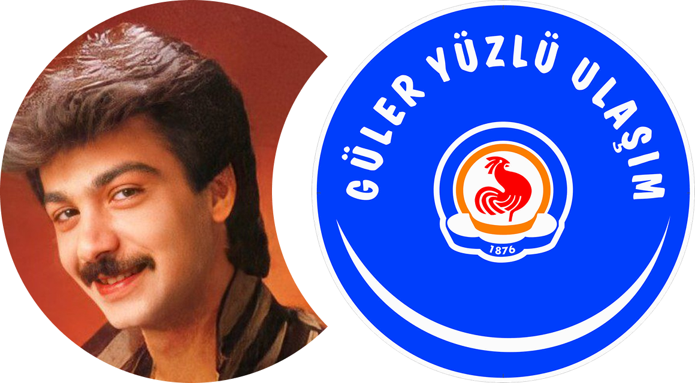

<div align="center">


Denizli Büyükşehir Belediyesi'nin resmi otobüs durak bilgi sistemi ile entegre çalışan, modern ve kullanıcı dostu bir web uygulaması.

[](https://opensource.org/licenses/MIT)
[](https://nextjs.org/)
[](https://www.typescriptlang.org/)
[](https://tailwindcss.com/)
</div>

## İçindekiler

- [Proje Hakkında](#proje-hakkında)
- [Özellikler](#özellikler)
- [Kullanılan Teknolojiler](#kullanılan-teknolojiler)
- [Proje Yapısı](#proje-yapısı)
- [Kurulum](#kurulum)
- [Katkıda Bulunma](#katkıda-bulunma)
- [Lisans](#lisans)
- [Destek](#destek)

## Proje Hakkında

**Denizli Akıllı Durak Sistemi**, Denizli şehrindeki toplu taşıma kullanıcılarına gerçek zamanlı otobüs bilgileri sunan bir Progressive Web App (PWA) uygulamasıdır. Uygulama, Denizli Büyükşehir Belediyesi'nin resmi API'leri ile entegre çalışarak kullanıcılara güncel ve doğru bilgiler sağlar.

### Temel Hedefler
- Toplu taşıma kullanıcılarının bekleme sürelerini minimize etmek
- Gerçek zamanlı otobüs varış bilgileri sunmak
- Modern ve kullanıcı dostu bir arayüz sağlamak
- Mobil ve masaüstü cihazlarda sorunsuz çalışan responsive tasarım
- PWA teknolojisi ile offline erişim imkanı

## Özellikler

### Durak Bilgi Sistemi
- **Durak numarası ile sorgulama**: Herhangi bir durak numarasını girerek o duraktan geçen otobüsleri görüntüleme
- **Gerçek zamanlı varış süreleri**: Otobüslerin durak varış sürelerini dakika cinsinden gösterme
- **Otobüs detay bilgileri**: Hat adı, plaka bilgisi, kalan durak sayısı

### Otobüs Hat Bilgileri
- **Hat bazında sorgulama**: Belirli bir otobüs hattının tüm duraklarını görüntüleme
- **Otobüs saatleri görüntüleme**: Hat numarası girerek otobüs sefer saatlerini resim formatında görüntüleme
- **Canlı hat arama**: Yazdıkça otobüs hatlarını filtreleme ve önerme

### Harita Entegrasyonu
- **İnteraktif harita**: Leaflet harita sistemi ile durak konumlarını görüntüleme
- **Otobüs konum takibi**: Gerçek zamanlı otobüs konumlarını harita üzerinde izleme
- **Durak haritası**: Seçili durakların harita üzerinde gösterimi

### Konum Tabanlı Özellikler
- **Yakındaki duraklar**: Kullanıcının konumuna göre en yakın durakları listeleme
- **Mesafe gösterimi**: Durakların kullanıcıya olan mesafesini metre ve kilometre cinsinden gösterme
- **Konum tabanlı arama**: Konum izni ile otomatik olarak yakındaki durakları bulma
- **Google Maps entegrasyonu**: Durakların konumunu Google Maps'te açma ve yol tarifi alma
- **Mesafe renk kodlaması**: Mesafeye göre renk kodlu mesafe göstergesi (yeşil: 200m, sarı: 500m, turuncu: 1000m)

### Kullanıcı Deneyimi
- **Son kullanılan duraklar**: Sık kullanılan durakları kaydetme ve hızlı erişim
- **Son aranan hatlar**: Geçmişte aranan otobüs hatlarını kaydetme
- **Karanlık/Aydınlık tema**: Kullanıcı tercihine göre tema değiştirme
- **Otomatik yenileme**: Belirli aralıklarla verileri otomatik güncelleme

### Ek Özellikler
- **QR Kod Tarama**: Durak tabelalarındaki QR kodları kamera ile tarayarak anında durak bilgilerine erişim
- **Hava durumu bilgisi**: Güncel Denizli hava durumu bilgisi
- **PWA desteği**: Mobil cihazlara uygulama olarak yüklenebilme
- **Offline çalışma**: Service Worker ile temel işlevlerin offline kullanımı
- **Responsive tasarım**: Tüm cihaz boyutlarında optimal görüntüleme

## Kullanılan Teknolojiler

### Frontend Framework
- **[Next.js 15](https://nextjs.org/)** - React tabanlı full-stack framework
- **[React 19](https://react.dev/)** - Kullanıcı arayüzü kütüphanesi
- **[TypeScript](https://www.typescriptlang.org/)** - Tip güvenli JavaScript

### UI/UX Kütüphaneleri
- **[Tailwind CSS](https://tailwindcss.com/)** - Utility-first CSS framework
- **[Shadcn/ui](https://ui.shadcn.com/)** - Yeniden kullanılabilir komponent kütüphanesi
- **[Radix UI](https://www.radix-ui.com/)** - Primitif UI komponentleri
- **[Lucide React](https://lucide.dev/)** - Modern ikon kütüphanesi
- **[next-themes](https://github.com/pacocoursey/next-themes)** - Tema yönetimi

### Harita ve Görselleştirme
- **[Leaflet](https://leafletjs.com/)** - Açık kaynak harita kütüphanesi
- **[React Leaflet](https://react-leaflet.js.org/)** - React için Leaflet entegrasyonu

### QR Kod ve Medya
- **[jsQR](https://github.com/cozmo/jsQR)** - JavaScript QR kod okuma kütüphanesi
- **MediaDevices API** - Kamera erişimi ve video stream yönetimi

### Form ve Validasyon
- **[React Hook Form](https://react-hook-form.com/)** - Form yönetimi
- **[Zod](https://zod.dev/)** - Schema validasyon

### Utility Kütüphaneleri
- **[clsx](https://github.com/lukeed/clsx)** - Koşullu CSS class yönetimi
- **[date-fns](https://date-fns.org/)** - Tarih işlemleri
- **[Class Variance Authority](https://cva.style/)** - Variant tabanlı stil yönetimi

### Development Tools
- **[ESLint](https://eslint.org/)** - Kod kalite kontrolü
- **[PostCSS](https://postcss.org/)** - CSS işleme
- **[Autoprefixer](https://autoprefixer.github.io/)** - CSS vendor prefix ekleme

### Deployment ve Analytics
- **[Vercel](https://vercel.com/)** - Hosting ve deployment
- **[@vercel/analytics](https://vercel.com/analytics)** - Web analitikleri

## Proje Yapısı

```
durak/
├── app/                          # Next.js App Router
│   ├── api/                      # API Routes
│   │   ├── bus-data/            # Otobüs verileri API'si
│   │   ├── bus-lines/           # Otobüs hatları API'si
│   │   ├── bus-schedule-search/ # Otobüs saatleri arama API'si
│   │   ├── bus-schedules/       # Otobüs saatleri API'si
│   │   ├── nearby-stations/     # Yakın duraklar API'si
│   │   └── weather/             # Hava durumu API'si
│   ├── globals.css              # Global CSS stilleri
│   ├── layout.tsx               # Ana layout bileşeni
│   ├── page.tsx                 # Ana sayfa bileşeni
│   ├── manifest.ts              # PWA manifest
│   ├── robots.ts                # Robots.txt
│   └── sitemap.ts               # Site haritası
├── components/                   # React bileşenleri
│   ├── ui/                      # Shadcn/ui bileşenleri
│   ├── bus-schedule.tsx         # Otobüs programı bileşeni
│   ├── qr-scanner-dialog.tsx    # QR kod tarama dialog bileşeni
│   ├── nearby-stations-dialog.tsx # Yakın duraklar dialog bileşeni
│   ├── leaflet-map.tsx          # Harita bileşeni
│   ├── station-input.tsx        # Durak girişi bileşeni
│   ├── theme-toggle.tsx         # Tema değiştirici
│   └── ...                      # Diğer bileşenler
├── hooks/                       # Custom React hooks
├── lib/                         # Utility fonksiyonları
│   ├── api.ts                   # API helper fonksiyonları
│   └── utils.ts                 # Genel utility fonksiyonları
├── public/                      # Statik dosyalar
│   ├── icons/                   # PWA ikonları
│   ├── images/                  # Uygulama görselleri
│   ├── manifest.json           # PWA manifest dosyası
│   └── sw.js                   # Service Worker
├── styles/                      # CSS dosyaları
├── next.config.mjs             # Next.js konfigürasyonu
├── tailwind.config.ts          # Tailwind CSS konfigürasyonu
├── tsconfig.json               # TypeScript konfigürasyonu
└── package.json                # Proje bağımlılıkları
```

### Önemli Bileşenler

- **`app/page.tsx`**: Ana sayfa ve tüm işlevselliğin koordine edildiği merkez bileşen
- **`components/bus-schedule.tsx`**: Otobüs verilerini tablo formatında gösteren ana bileşen
- **`components/qr-scanner-dialog.tsx`**: QR kod tarama işlevselliği ve kamera yönetimi bileşeni
- **`components/nearby-stations-dialog.tsx`**: Konum tabanlı yakın duraklar arama ve listeleme bileşeni
- **`components/leaflet-map.tsx`**: Harita görüntüleme ve etkileşim bileşeni
- **`lib/api.ts`**: Tüm API çağrılarının merkezi yönetimi
- **`app/api/*`**: Backend API route'ları, CORS proxy olarak çalışır

## Kurulum

### Gereksinimler
- Node.js 18+ veya daha üst versiyonu
- npm, yarn veya pnpm paket yöneticisi

### Adım Adım Kurulum

1. **Projeyi klonlayın**
   ```bash
   git clone https://github.com/umutcandev/denizli-ulasim-durak.git
   cd denizli-ulasim-durak
   ```

2. **Bağımlılıkları yükleyin**
   ```bash
   # npm ile
   npm install
   
   # veya yarn ile
   yarn install
   
   # veya pnpm ile (önerilen)
   pnpm install
   ```

3. **Geliştirme sunucusunu başlatın**
   ```bash
   # npm ile
   npm run dev
   
   # veya yarn ile
   yarn dev
   
   # veya pnpm ile
   pnpm dev
   ```

4. **Uygulamayı açın**
   Tarayıcınızda [http://localhost:3000](http://localhost:3000) adresini açın

### Production Build

```bash
# Build oluşturma
npm run build

# Production sunucusunu başlatma
npm run start
```

### Linting

```bash
npm run lint
```

## Katkıda Bulunma

Bu projeye katkıda bulunmak isterseniz:

1. **Fork** edin
2. Feature branch oluşturun (`git checkout -b feature/amazing-feature`)
3. Değişikliklerinizi commit edin (`git commit -m 'feat: amazing feature eklendi'`)
4. Branch'inizi push edin (`git push origin feature/amazing-feature`)
5. **Pull Request** oluşturun

### Katkı Kuralları

- Kod değişiklikleri için type-safe TypeScript kullanın
- Yeni bileşenler için Shadcn/ui standartlarını takip edin
- Commit mesajlarında [Conventional Commits](https://www.conventionalcommits.org/) formatını kullanın
- Büyük değişiklikler için önce issue açın

### Geliştirme Ortamı

- **Code Style**: ESLint ve Prettier konfigürasyonu
- **Type Checking**: TypeScript strict mode
- **Component Library**: Shadcn/ui bileşen standardı
- **CSS Framework**: Tailwind CSS utility classes

## Lisans

Bu proje MIT lisansı altında lisanslanmıştır. Detaylar için [LICENSE](LICENSE) dosyasına bakabilirsiniz.

```
MIT License

Copyright (c) 2025 Umutcan

Permission is hereby granted, free of charge, to any person obtaining a copy
of this software and associated documentation files (the "Software"), to deal
in the Software without restriction, including without limitation the rights
to use, copy, modify, merge, publish, distribute, sublicense, and/or sell
copies of the Software, and to permit persons to whom the Software is
furnished to do so, subject to the following conditions:

The above copyright notice and this permission notice shall be included in all
copies or substantial portions of the Software.

THE SOFTWARE IS PROVIDED "AS IS", WITHOUT WARRANTY OF ANY KIND, EXPRESS OR
IMPLIED, INCLUDING BUT NOT LIMITED TO THE WARRANTIES OF MERCHANTABILITY,
FITNESS FOR A PARTICULAR PURPOSE AND NONINFRINGEMENT. IN NO EVENT SHALL THE
AUTHORS OR COPYRIGHT HOLDERS BE LIABLE FOR ANY CLAIM, DAMAGES OR OTHER
LIABILITY, WHETHER IN AN ACTION OF CONTRACT, TORT OR OTHERWISE, ARISING FROM,
OUT OF OR IN CONNECTION WITH THE SOFTWARE OR THE USE OR OTHER DEALINGS IN THE
SOFTWARE.
```

## Destek

Herhangi bir sorun yaşarsanız:

### Sık Sorulan Sorular

**S: Durak bilgileri neden gelmiyor?**
A: Denizli Büyükşehir Belediyesi'nin API sunucusu geçici olarak kapalı olabilir. Birkaç dakika sonra tekrar deneyin.

**S: QR kod tarama özelliği çalışmıyor**
A: Tarayıcınızın kamera iznini verdiğinizden emin olun. Chrome, Safari ve Firefox'un güncel sürümlerinde desteklenir. Kamera başka bir uygulama tarafından kullanılıyor olabilir.

**S: QR kod tarandı ama durak bilgileri gelmiyor**
A: Taradığınız QR kodun Denizli Büyükşehir Belediyesi'nin resmi durak QR kodu olduğundan emin olun. QR kod formatı: `https://ulasim.denizli.bel.tr/akillidurak/?durakno=[numara]`

**S: Uygulama mobil cihazımda çalışmıyor**
A: Tarayıcınızın güncel olduğundan emin olun. PWA özelliği Chrome, Safari ve Firefox'un son sürümlerinde desteklenir.

**S: Harita görünmüyor**
A: JavaScript'in etkin olduğundan ve konum izinlerinin verildiğinden emin olun.

**S: Yakındaki duraklar özelliği çalışmıyor**
A: Tarayıcınızın konum iznini verdiğinizden emin olun. Chrome, Safari ve Firefox'un güncel sürümlerinde desteklenir. Konum bilgisi alınamazsa, tarayıcı ayarlarından konum iznini kontrol edin.

**S: Yakındaki duraklar listelenmiyor**
A: Konum izni verildikten sonra birkaç saniye bekleyin. Eğer hala duraklar gelmiyorsa, yakınınızda durak olmayabilir veya API geçici olarak kapalı olabilir.

### Hata Bildirimi

Bir hata bulduysanız:

1. [GitHub Issues](https://github.com/umutcandev/denizli-ulasim-durak/issues) sayfasında aynı sorunu araştırın
2. Bulamazsanız yeni issue oluşturun
3. Hatayı detaylı şekilde açıklayın:
   - İşletim sistemi ve tarayıcı bilgisi
   - Hata ekran görüntüsü
   - Hatayı tekrarlama adımları
   - Beklenen ve gerçekleşen davranış

### Özellik İsteği

Yeni özellik önerileriniz için:

1. [GitHub Issues](https://github.com/umutcandev/denizli-ulasim-durak/issues) üzerinden özellik isteği oluşturun
2. Özelliği detaylı şekilde açıklayın
3. Kullanım senaryolarını belirtin
4. Mümkünse mockup veya örnek görseller ekleyin